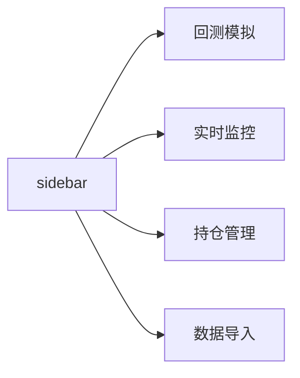

## 用户需求

开发一个名为 `option_sell_hedge` 的期权卖出对冲策略研究与监控系统，基于卖出宽跨式 Strangle（同时卖出 OTM 认购 + 认沽期权），赚取波动率收窄和时间价值收敛的收益。

## 产品概述

系统分为两大模块：**回测模拟**和**实时监控**，均通过 Streamlit Web 界面操作。

支持多个标的（沪深300ETF、50ETF、中证1000ETF等），数据来源支持手动上传 Excel 和 akshare/tushare 自动拉取两种方式。

## 核心功能

### 数据输入层

- **手动上传模式**：t 时点上传期权列表 Excel（含标的代码、行权价、到期日、类型 call/put、期权价格、隐含波动率等），同时上传标的历史价格序列
- **自动拉取模式**：通过 akshare 拉取指定标的当月到期的 ETF 期权链（包括行权价、IV、Greeks），以及标的近 1 个月日线行情

### BS 定价与 Greeks 计算

- 基于 Black-Scholes 模型计算期权理论价格、Delta、Gamma、Vega、Theta
- 卖出端希腊字母符号取反（卖方持仓视角：Theta 为正、Vega 为负）

### Strangle 选仓逻辑

- 自动筛选 OTM call（行权价 > 当前价）和 OTM put（行权价 < 当前价）
- 支持按 Delta 绝对值筛选（如 |Delta| ≈ 0.15~0.25 范围的 OTM 期权）
- 支持用户手动选定行权价组合

### 回测模拟模块

- 输入：期权列表 + t 到到期日的标的价格路径（日收盘价序列）
- 每日用 BS 模型重定价，计算持仓盈亏（期权现值 - 开仓价）
- 到期日按实内在价值结算（max(S-K,0) for call，max(K-S,0) for put）
- 输出：逐日盈亏曲线、累计收益、最大回撤、胜率、盈亏比等统计指标
- 可视化：价格路径 + 行权价区间叠加图、盈亏曲线图

### 实时监控模块

- 类似 option_risk_monitor 结构，实时展示当前卖出持仓的 Greeks 汇总
- 监控组合 Net Delta、Net Vega、Net Theta、Net Gamma
- 预警：Net Delta 偏离过大（需对冲）、到期日临近（需滚仓）、亏损超阈值
- 每 30 秒自动刷新

### 数据持久化

- 开仓记录保存至 Excel（持仓快照）
- 回测结果保存至 Excel

## 技术栈

| 层次 | 技术 |
| --- | --- |
| UI 框架 | Python 3.7 + Streamlit 1.23.1 |
| 数值计算 | numpy, scipy.stats（BS 模型，复用 option_risk_monitor 模式） |
| 数据处理 | pandas 1.1.5 |
| 自动数据源 | akshare（ETF期权链、日线行情） |
| 可视化 | plotly（交互式图表，替代 option_risk_monitor 的静态表格） |
| 文件 IO | openpyxl（Excel 读写） |


## 实现策略

### 架构设计

沿用 `option_risk_monitor` 的 Streamlit sidebar radio 多页结构，扩展为 4 个页面：



### 核心模块拆分

```
option_sell_hedge/
├── app.py                  # [NEW] 入口，Streamlit 页面路由
├── bs_engine.py            # [NEW] BS 定价引擎（复用+扩展 option_risk_monitor）
├── strangle_builder.py     # [NEW] Strangle 选仓逻辑（OTM 筛选、Delta 范围过滤）
├── backtest_engine.py      # [NEW] 回测引擎（逐日重定价、到期结算、绩效统计）
├── data_loader.py          # [NEW] 数据加载器（手动上传 + akshare 自动拉取）
├── monitor.py              # [NEW] 实时监控页面逻辑
├── templates/
│   └── option_input_template.xlsx  # [NEW] 手动上传 Excel 模板
├── requirements.txt        # [NEW]
└── README.md               # [NEW]
```

### BS 定价引擎（bs_engine.py）

直接复用 `option_risk_monitor.py` 中的 `calculate_delta_values` 函数，扩展支持：

- 同时计算期权理论价格（call/put price）
- 支持 `option_type='put'` 的完整定价
- 卖方视角的 Greeks 符号翻转

```python
def bs_price_and_greeks(S, K, T_days, r, sigma, option_type='call') -> dict:
    """返回 price, delta, gamma, vega, theta"""
```

### 回测引擎逻辑（backtest_engine.py）

```
for each trading_day in price_path:
    for each position in strangle_positions:
        T_remaining = (expiry_date - trading_day).days
        if T_remaining <= 0:
            pnl = settlement_pnl(S, K, option_type)  # 到期结算
        else:
            current_price = bs_price(S, K, T_remaining, r, sigma)
            pnl = (open_price - current_price) * multiplier  # 卖方：开仓价 - 现值
```

**绩效统计**：

- 累计收益率、年化收益率
- 最大回撤（MDD）
- Sharpe 比率（假设无风险利率 r）
- 胜率（到期盈利次数 / 总到期次数）

### 数据加载器（data_loader.py）

**手动上传模式**：

- Streamlit `st.file_uploader` 接收 Excel
- 必填列：`ts_code`（标的代码）、`strike_price`（行权价）、`call_put`（C/P）、`exp_date`（到期日）、`open_price`（期权开仓价）、`iv`（隐含波动率）

**自动拉取模式**（akshare）：

```python
# 获取 50ETF 期权链
import akshare as ak
df_chain = ak.option_sse_greeks_em(symbol="50ETF")
df_spot  = ak.fund_etf_hist_em(symbol="510050", period="daily")
```

支持的标的映射表（可在 app.py 配置）：

| 标的名称 | akshare symbol |
| --- | --- |
| 50ETF | 510050 |
| 300ETF | 510300 |
| 中证1000ETF | 159922 |


### 实时监控（monitor.py）

复用 `option_risk_monitor` 的结构：

- 读取持仓快照 Excel
- 拉取最新行情（akshare 或 quote_now.xlsx）
- 计算 Portfolio Net Greeks
- 预警条件：`|Net Delta| > 0.3`（建议 Delta 对冲）、`Days to Expiry <= 5`（滚仓预警）、`累计亏损 > 初始权利金 * 1.5`

## 实现要点

1. **Python 3.7 兼容**：避免使用 3.8+ 语法（walrus operator `:=`、`f-string = `等），`typing `用 `Dict`/`List` 而非内置泛型
2. **数据路径**：沿用 `D:\auto_tc\data_sync\` 作为默认路径，同时支持用户在 sidebar 配置路径
3. **akshare 版本兼容**：先检查 `ak.option_sse_greeks_em` 是否可用，降级为手动上传模式
4. **Streamlit 1.23.1**：使用 `st.experimental_rerun()` 而非 `st.rerun()`，避免版本不兼容
5. **避免除零**：BS 公式中 T、sigma 需有正数保护（复用 option_risk_monitor 现有保护逻辑）
6. **plotly 交互图**：使用 `st.plotly_chart(fig, use_container_width=True)` 展示回测盈亏曲线和价格路径图

## 目录结构

```
c:\rc_202X\rc_202X\ciss_web\CISS_rc\apps\agent\code_buddy\option_sell_hedge\
├── app.py                          # [NEW] Streamlit 主入口，sidebar 路由，4 页切换
├── bs_engine.py                    # [NEW] BS 定价核心：bs_price_and_greeks()，复用 option_risk_monitor 的计算逻辑并扩展
├── strangle_builder.py             # [NEW] Strangle 选仓：filter_otm_options()，按 Delta 范围筛选 OTM call/put
├── backtest_engine.py              # [NEW] 回测引擎：run_backtest()，逐日 BS 重定价 + 到期结算 + 绩效统计
├── data_loader.py                  # [NEW] 数据加载：load_from_excel()，load_from_akshare()，支持多标的映射
├── monitor.py                      # [NEW] 实时监控页面：load_positions()，calc_portfolio_greeks()，警报逻辑
├── templates/
│   └── option_input_template.xlsx  # [NEW] 手动上传期权列表的 Excel 模板，含示例数据和字段说明
├── requirements.txt                # [NEW] 依赖：streamlit, pandas, numpy, scipy, plotly, akshare, openpyxl
└── README.md                       # [NEW] 使用说明：启动方式、数据格式、策略逻辑说明
```

## 设计风格

基于 Streamlit 框架构建，采用深色金融风格（Dark Finance），与 option_risk_monitor 保持视觉一致性，同时增加交互式图表提升研究体验。

### 页面布局

**侧边栏（Sidebar）**

- 页面导航：回测模拟 / 实时监控 / 持仓管理 / 数据导入
- 全局配置：数据路径、无风险利率 r、自动刷新开关

**回测模拟页**

- 上半区：参数设置区（标的选择、Delta 范围滑块、到期月份）
- 中间区：期权链表格（可筛选行权价，高亮 OTM 区间）
- 下半区：三列图表——标的价格路径+行权价边界叠加图、逐日盈亏曲线、绩效统计卡片

**实时监控页**

- 顶部：4 个 metric 卡片（Net Delta、Net Vega、Net Theta、组合盈亏）
- 中部：持仓明细表格（带颜色渐变 Delta 列，复用 option_risk_monitor 样式）
- 底部：预警区（红/黄色边框卡片，复用 display_warning_cards 模式）

**持仓管理页**

- 新增/删除 Strangle 组合
- 显示历史开仓记录

**数据导入页**

- 标签切换：手动上传 / 自动拉取
- 手动上传：文件上传组件 + 预览表格 + 下载模板按钮
- 自动拉取：标的选择下拉框 + 拉取按钮 + 结果预览

## 使用的 Agent Extensions

### Skill: xlsx

- **用途**：生成手动上传期权列表的 Excel 模板文件 `option_input_template.xlsx`，包含字段说明行、示例数据行和数据验证（call_put 列枚举限制为 C/P）
- **预期结果**：模板文件包含正确列头（ts_code, strike_price, call_put, exp_date, open_price, iv, multiplier）及示例数据，用户可直接下载填写后上传